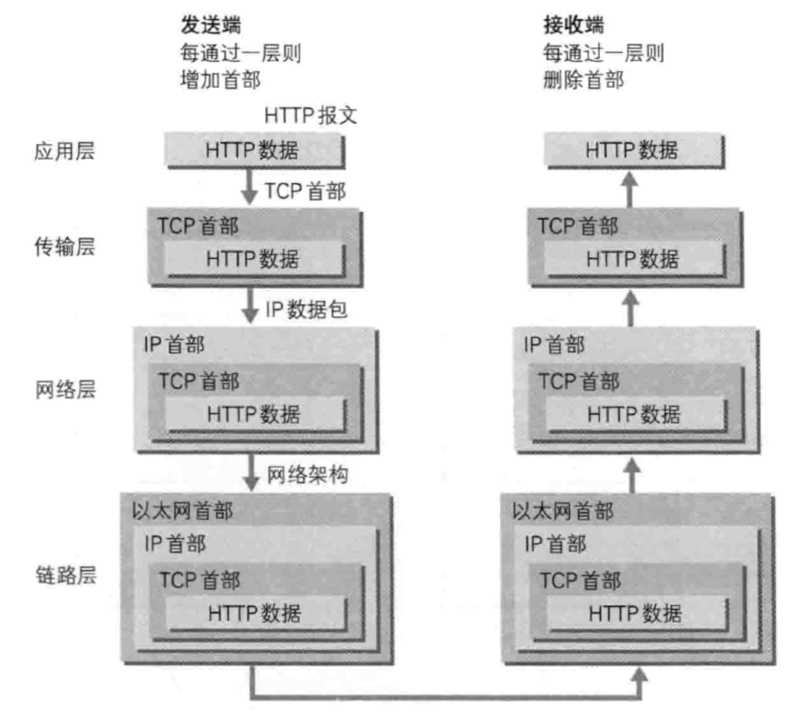
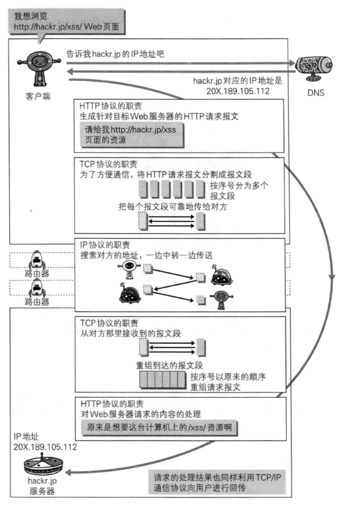
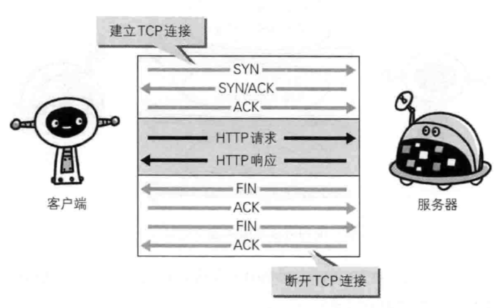

# 每天30页

## 第一章

### 1.1
web是建立在http协议上通信的。

### 1.2
SGML 标准通用标记语言

### 1.3
http属于tcp/ip内部的一个子集

tcp/ip 4层：应用层、传输层、网络层、数据链路层。

应用层：ftp、dns、http

传输层：tcp、udp

网络层：处理网络上流动的数据包

链路层：处理连接网络硬件部分：操作系统，硬件，网卡

### 1.4

负责传输的IP协议

IP网际协议位于网络层

ARP解析地址的协议，根据通信方的IP地址就可以反查出对应的mac地址

确保可靠性的TCP协议

TCP协议把大数据分割成报文段，能够确认最终是否能送达对方

三次握手：1.syn标志 2.syn ack 标志  3.ack标志

dns：域名到IP地址解析

## 第二章

### 2.2

请求报文由请求方法，请求uri，协议版本，可选的请求首部字母和内容实体构成。

响应报文由协议版本，状态码，解释状态码的原因短语，可选的响应首部字段以及实体主体构成

### 2.3

http是无状态的，因为这样可以处理大量事务，确保协议的可伸缩性。但有了cookie就可以管理状态了。

### 2.5

If-Modified-Since: 时间 -> 返回时间以后更新过的资源，如未更新 状态码是304 not modified

302 暂时重定向

PUT：传输文件

HEAD：获得报文首部

http/1.1 PUT 和 DELETE不带验证机制 所以一般不使用

OPTIONS：询问支持的方法

TRACE：追踪路径

CONNECT：要求用隧道协议连接代理

### 2.7

http协议初版，每进行一次http通信，就要断开一次TCP连接

故 http/1.1 和部分 http/1.0 想出持久连接：只要任意一端没有明确提出断开连接，则保持TCP连接 -> 建立一次TCP连接后进行多次请求和响应的交互

http/1.1 默认都是持久连接

持久连接使得多数请求可以并发发送

### 2.8

cookie：通过在请求和响应中写入cookie信息来控制客户端的状态

响应报文：Set-Cookie的首部字段信息，通知客户端保存cookie，客户端在请求报文加入Cookie值后发送。服务端拿到cookie后，对比记录，拿到以前的相应状态信息。

## 第三章

### 3.1

http报文：报文首部 报文主体（可选） 两者由空行划分

p47

### 3.1

### 3.1

### 3.1

### 3.1

